<div style="background-color: #000; display: flex; justif-content: center;">
    
</div>
<p align="center"> </p>

<h1 align="center">Teste para processo seletivo Front End Ioasys</h1>

# ✅ Sobre o projeto e desenvolvimento

Aplicação web construida em React JS e Redux para gerenciamento de estado. A ideia da aplicação é uma biblioteca virtual.
Procurei tornar-la extremamente responsiva, respeitando todas proporções contidas no mockup.
Obrigado Ioasys pela oportunidade :)

# ✅ Features

- [x] Login
- [x] Validação de formulário
- [x] Listagem de livros
- [x] Paginação

# ✅ Instalação

```bash
  git clone git@github.com:cirineurodrigues/book.git
  cd book/
  yarn install
  yarn start
```

# ✅ Usuário de Testes

```bash
  desafio@ioasys.com.br
  12341234
```

# 📱 Telas

<h2 align="center">Login</h2>

Na tela de login, realizei a validação do formulário, inclui um spinner e um feedback para o usuário caso o email ou senha estivessem incorretos.

<p align="center"> 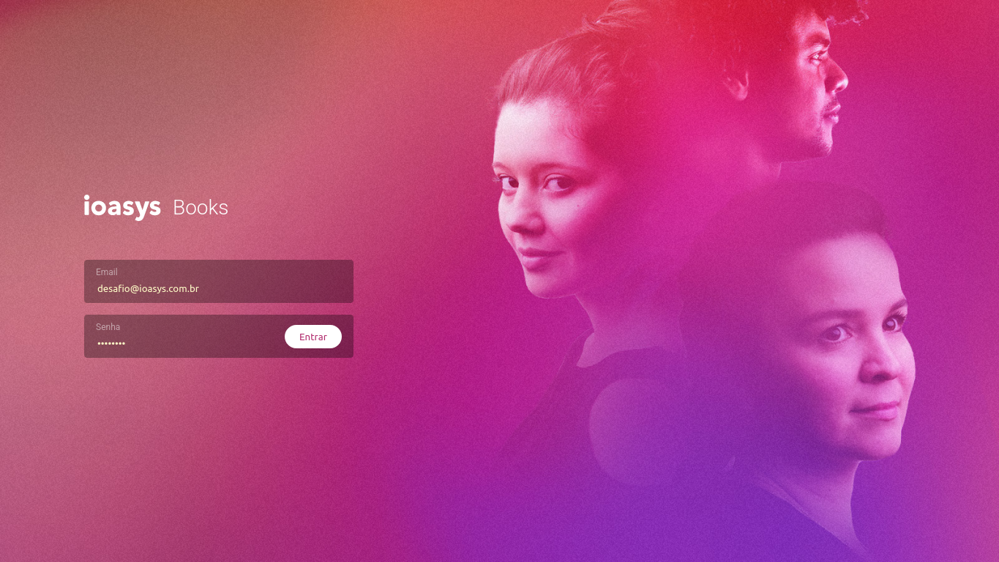</p>

<p align="center"> 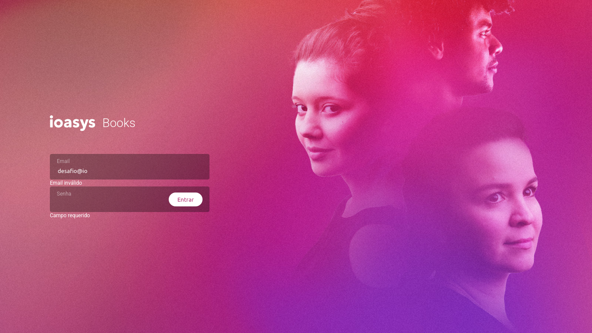</p>

<p align="center"> 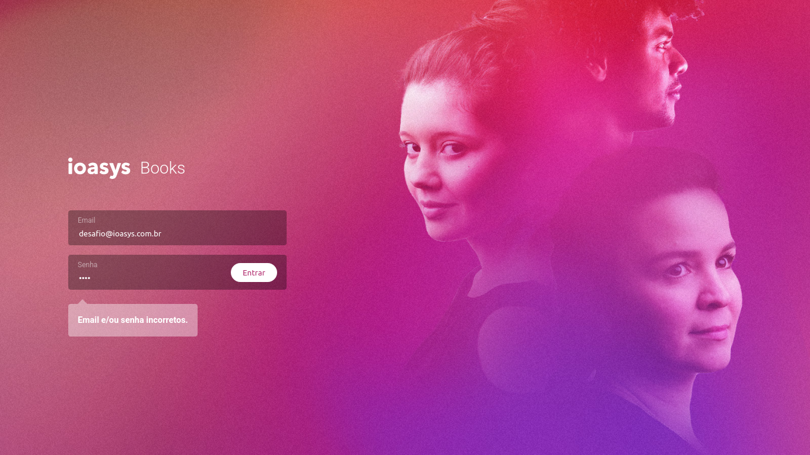</p>

<p align="center"> 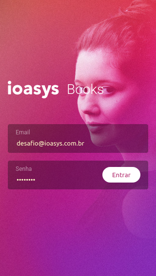</p>

<p align="center"> 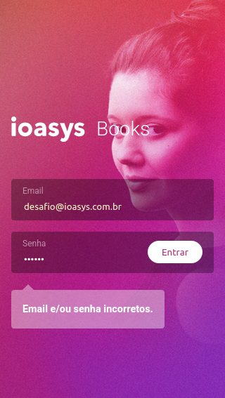</p>

<h2 align="center">Home</h2>

Na tela onde os livros são renderizados, busquei atender a todos os tipos de telas, mantendo a proporção do mockup.

<p align="center"> 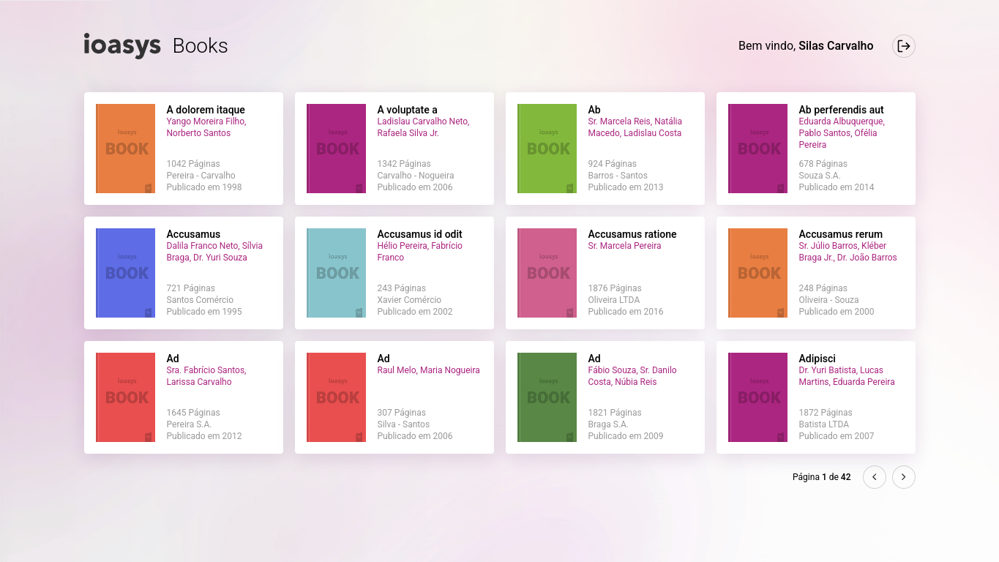</p>

<p align="center"> 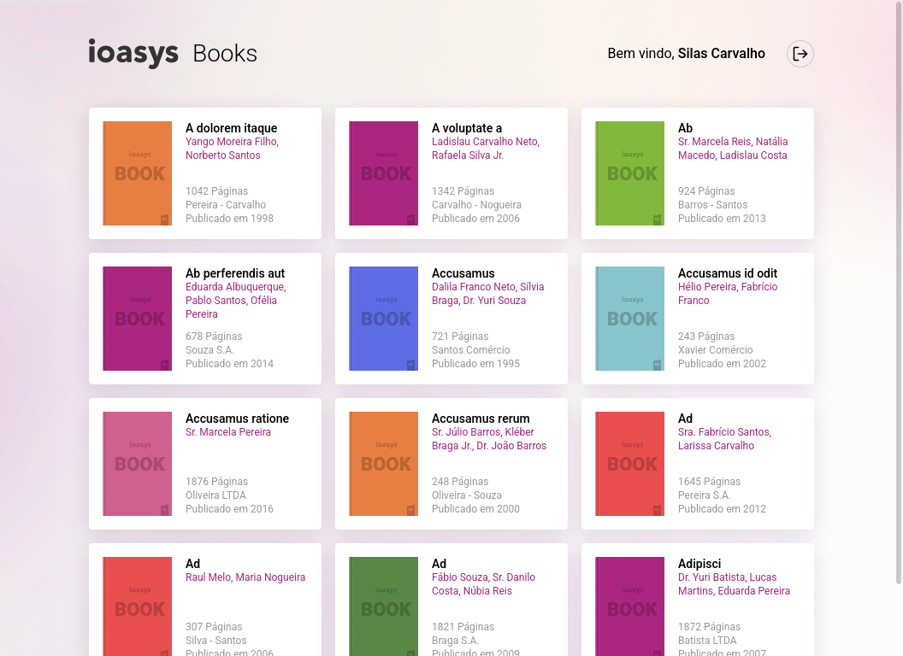</p>

<p align="center"> 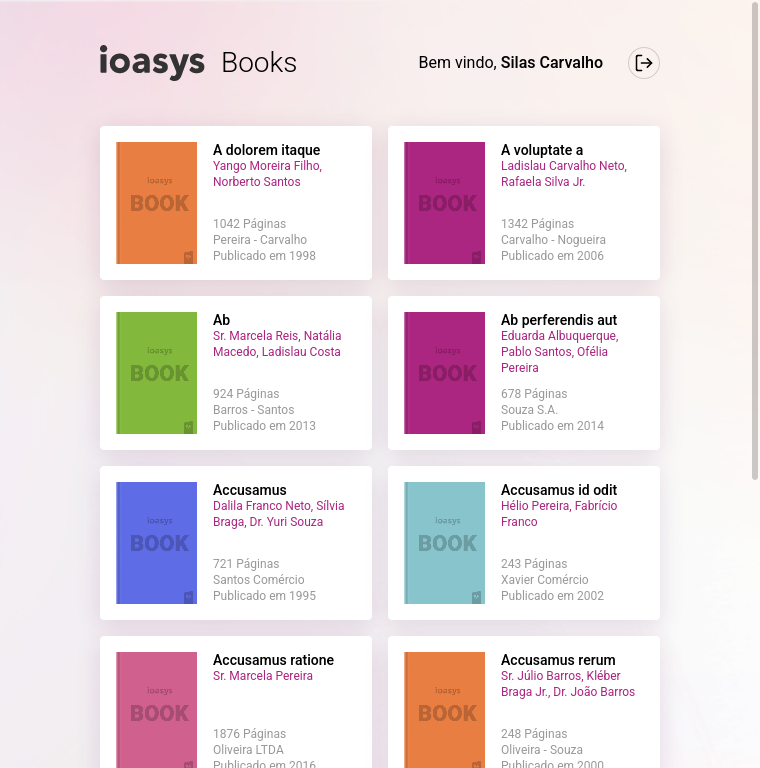</p>

<p align="center"> 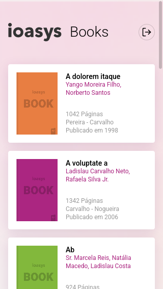</p>

<h2 align="center">Modal</h2>

<p align="center"> 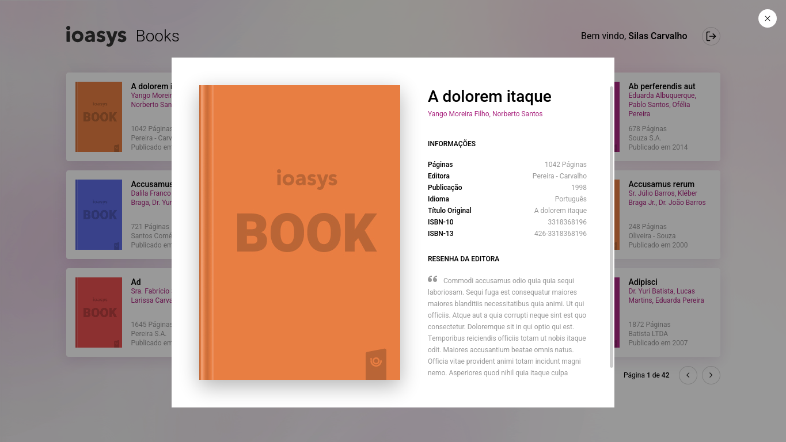</p>

<p align="center"> 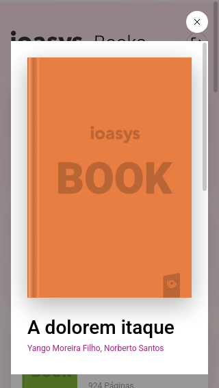</p>

# 🛠 Tecnologias utilizadas

- [ReactJS](https://reactjs.org/)
- [Redux](https://redux.js.org/)
- [React-Redux](https://react-redux.js.org/)
- [Axios](https://github.com/axios/axios)
- [Styled Components](https://styled-components.com/)
- [React Hook Form](https://react-hook-form.com/)
- [Yup](https://github.com/jquense/yup)
- [React Spinners](https://www.npmjs.com/package/react-spinners)

# ✅ Status do Projeto

<h3 align="center"> 
    🚀 Concluído 🚀
</h3>

# 👨‍💻 Dev

- Made with ❤️ by [Cirineu Rodrigues](https://www.linkedin.com/in/cirineurodrigues/)
